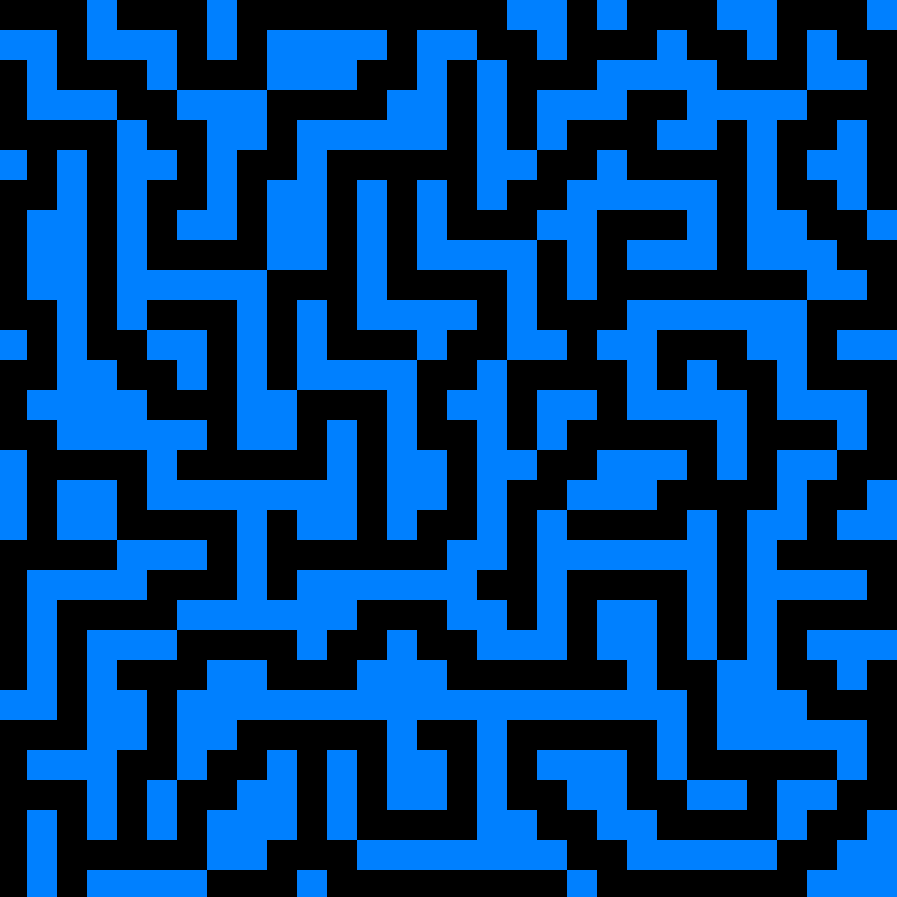

# Maze Generator
Script generating maze by given algorithm and showing it graphically 

## Features
### Generating maze
Generate the maze with my algorithm, or use your own.
[This wikipedia page](https://en.wikipedia.org/wiki/Maze_generation_algorithm) contains many interesting examples of maze generation.

### Displaying maze
Use provided package to display the generated maze.

## How to use it
### Dependencies
Script requires `Python 3` with `PyGame` installed on your machine.

### Default algorithm
Clone this repo on your local machine and go into project folder:

    git clone https://github.com/FranciszekPin/maze-generator
    cd maze-generator

To see default maze run:

    python3 main.py

You should see some random maze from picture above.

### Changing maze properties
It is possible to change few maze properties. In `main.py` there is a section:

    # edit this variables to create your custom maze
    # --------------------
    TILE_SIZE = 30          # defines the length of the edge of the square in pixels
    NUMBER_OF_ROWS = 30     # defines number of tiles in column
    NUMBER_OF_COLUMNS = 30  # defines number of tiles in row
    # --------------------

By changing this values you can change maze's size, width and height.

### Using your own algorithm
`mazegen.py` is default module for generating maze. If you want to use your own algorithm, you should edit get_maze in this file:

    def get_maze(width, height):
        init_empty_maze(width, height)
    
        generate_maze(0, 0, width, height) # this line should be replaced by calling your own function 
    
        return maze

Your algorithm should modify `maze` variable, which is 2D Python list. 
By default, this list has all values set to `'x'` which means 'no crossing'.
By setting some maze values to `' '` you can define where there should be 'crossing'.
Your algorithm should work for given `width` and `height`.

For example, you can define custom_algo(width, height):
    
    def custom_algo(width, height):
        maze[0][0] = ' '

Then, use it inside 'get_maze' function:

     def get_maze(width, height):
        init_empty_maze(width, height)
    
        custom_algo(width, height) # line replaced with generate_maze() 
    
        return maze

As a result, you will get the following maze:

